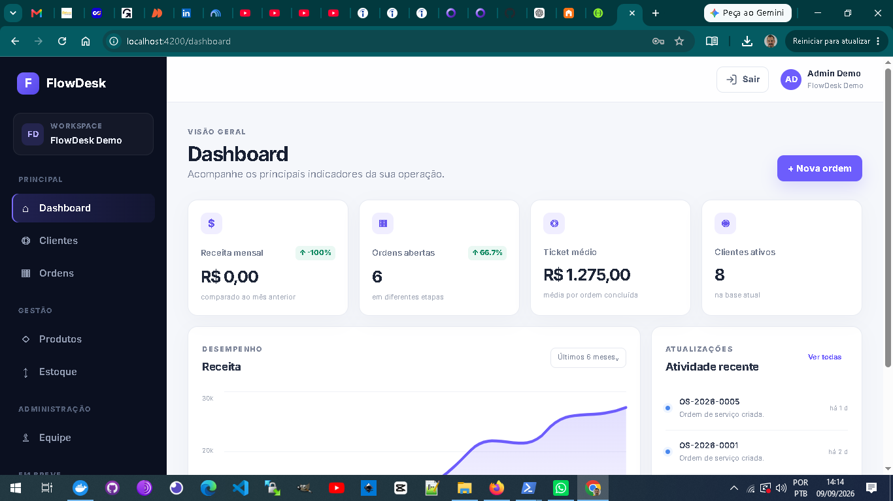
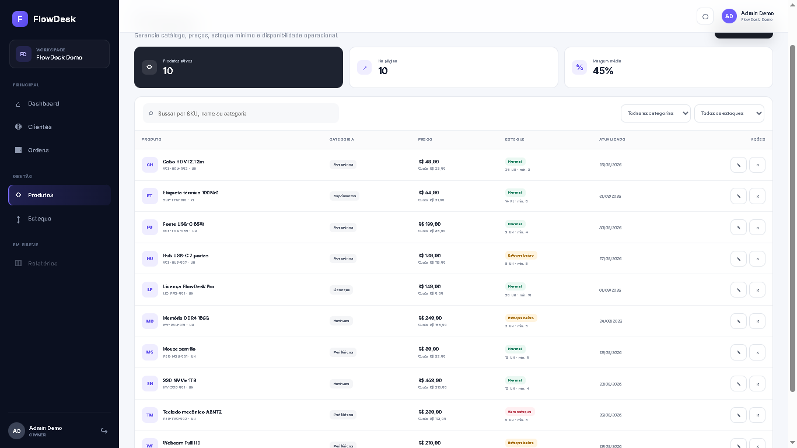
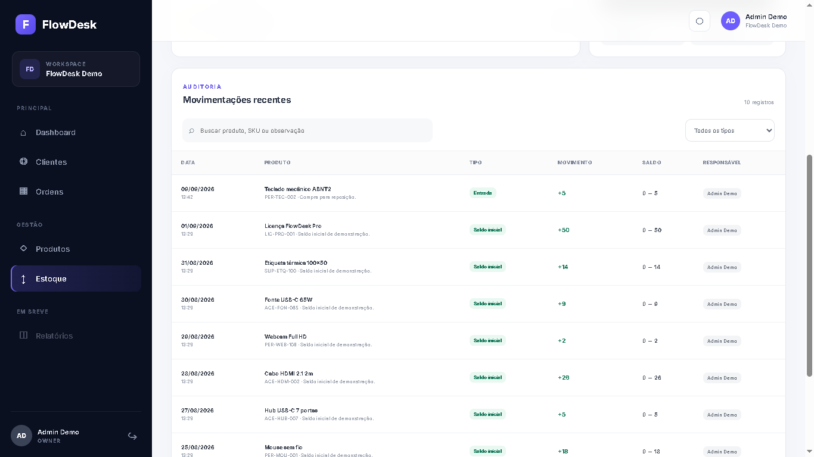

# FlowDesk
> Modern Business Operations Platform · Angular 17 + ASP.NET Core 8 + PostgreSQL

FlowDesk is a production-ready business operations platform demonstrating a modern enterprise-oriented stack with Angular 20, ASP.NET Core 8, PostgreSQL, Docker, multi-tenancy, JWT/RBAC, inventory transactions and automated testing.

E organizar visualmente:

FlowDesk
├── Screenshots
├── Features
├── Architecture
├── Tech Stack
├── RBAC
├── Multi-tenancy
├── Inventory transaction flow
├── Local development
├── Docker production
├── Demo accounts
├── Testing
├── API
└── Architecture decisions

FlowDesk é um SaaS de gestão operacional criado como projeto de portfólio Full Stack. O projeto demonstra arquitetura de aplicação empresarial, autenticação/autorização, multi-tenancy, regras de estoque, auditoria, analytics, testes e entrega em containers.



## Destaques técnicos

- Angular 20 com standalone components, Signals, RxJS e Reactive Forms.
- Angular CDK para Kanban drag-and-drop.
- ASP.NET Core 8 Web API + Entity Framework Core 8.
- PostgreSQL 16 com migrations.
- JWT + RBAC (`OWNER`, `ADMIN`, `MANAGER`, `USER`).
- Isolamento multi-tenant por `companyId`.
- Estoque auditável com entrada, saída, ajuste e estorno automático.
- Produtos e serviços dentro da OS, com total calculado no backend.
- Relatórios e exportação CSV.
- Dark mode persistente e feedback global.
- Docker + Nginx + healthchecks.
- GitHub Actions com testes, build e build das imagens Docker.

## Screenshots

### Catálogo e estoque





## Fluxo de negócio que diferencia o projeto

Um produto pode ser incluído em uma ordem sem alterar o saldo imediatamente:

```text
Adicionar produto à OS
       │
       ▼
OS aberta ──────────────── estoque preservado
       │
       ▼
Finalizar OS
       │
       ├─ valida saldo
       ├─ cria EXIT auditável
       └─ registra atividade na timeline
       │
       ▼
Reabrir OS
       │
       ├─ cria ENTRY de estorno
       └─ devolve o estoque automaticamente
```

## Funcionalidades

### Operação

- Dashboard com KPIs.
- Clientes com busca e paginação server-side.
- Ordens de serviço com numeração automática.
- Kanban de status.
- Timeline e auditoria.
- Itens de produtos e serviços, quantidade, preço e desconto.
- Produtos, SKU, custo, venda e estoque mínimo.
- Entrada, saída e ajuste de estoque.
- Relatórios por período e exportação CSV.

### Segurança e administração

- Autenticação JWT.
- RBAC no Angular e no backend.
- Gestão de equipe.
- Multi-tenancy por empresa.
- Guards e interceptors.
- Páginas 403 e 404.

## Stack

| Camada | Tecnologias |
|---|---|
| Frontend | Angular 20, TypeScript, RxJS, Signals, Reactive Forms, Angular CDK |
| Backend | ASP.NET Core 8, C#, Entity Framework Core |
| Banco | PostgreSQL 16 |
| Segurança | JWT, RBAC, multi-tenancy |
| Infra | Docker, Docker Compose, Nginx, GitHub Actions |
| Testes | xUnit, Jasmine/Karma, smoke test PowerShell |

## Perfis demo

Senha de todos os perfis: `FlowDesk@123`

| Perfil | E-mail | Acesso |
|---|---|---|
| OWNER | `admin@flowdesk.dev` | Acesso total |
| ADMIN | `admin.ops@flowdesk.dev` | Administração e operação |
| MANAGER | `gestor@flowdesk.dev` | Gestão operacional |
| USER | `operador@flowdesk.dev` | Operação limitada |

A tela de login permite selecionar o perfil e preencher as credenciais automaticamente.

## Desenvolvimento local

### PostgreSQL

```powershell
docker compose up -d
```

### Backend

```powershell
cd backend\FlowDesk.Api
dotnet restore
dotnet run
```

API: `http://localhost:5080`  
Swagger: `http://localhost:5080/swagger`

### Frontend

```powershell
cd frontend\flowdesk-web
npm install
npm start
```

Frontend: `http://localhost:4200`

O dev server encaminha `/api` para `http://localhost:5080`.

## Stack completa em Docker

```powershell
Copy-Item .env.example .env
# altere as credenciais do .env
docker compose -f docker-compose.prod.yml up -d --build
```

- Aplicação: `http://localhost:8080`
- API: `http://localhost:5080`
- PostgreSQL: somente rede interna do Docker

## Testes

Backend:

```powershell
cd backend\FlowDesk.Api.Tests
dotnet test -c Release
```

Frontend:

```powershell
cd frontend\flowdesk-web
npm test
```

Tudo de uma vez:

```powershell
.\scripts\verify.ps1
```

Com a stack Docker em execução:

```powershell
.\scripts\smoke.ps1
```

Mais detalhes em [docs/TESTING.md](docs/TESTING.md).

## CI

`.github/workflows/ci.yml` executa em pushes/PRs para `main` e `develop`:

```text
Backend → restore → build → xUnit
Frontend → npm install → Jasmine/Karma → production build
Containers → build API image → build web image
```

## Endpoints principais

```text
POST   /api/auth/login
GET    /api/dashboard/summary
GET    /api/customers
GET    /api/orders
POST   /api/orders/{orderId}/items
PATCH  /api/orders/{id}/status
GET    /api/products
GET    /api/inventory/summary
POST   /api/inventory/products/{productId}/movements
GET    /api/team
GET    /api/reports/overview
GET    /api/reports/export/orders.csv
GET    /api/health
```

## Documentação

- [Arquitetura](docs/ARCHITECTURE.md)
- [Testes](docs/TESTING.md)
- [Deploy e operação](docs/DEPLOYMENT.md)
- [Publicação no GitHub](docs/GITHUB.md)
- [Segurança](SECURITY.md)
- [Contribuição](CONTRIBUTING.md)

## Sprints concluídos

1. Base Angular + .NET + PostgreSQL + JWT.
2. Clientes.
3. Ordens + Kanban + auditoria.
4. Produtos + estoque.
5. Equipe + RBAC.
6. Relatórios + Analytics.
7. Polimento, dark mode, Docker e CI.
8. Itens de produtos/serviços nas ordens + integração com estoque.
9. Testes, smoke tests, documentação final e preparação para GitHub.

## Licença

MIT. Veja [LICENSE](LICENSE).
